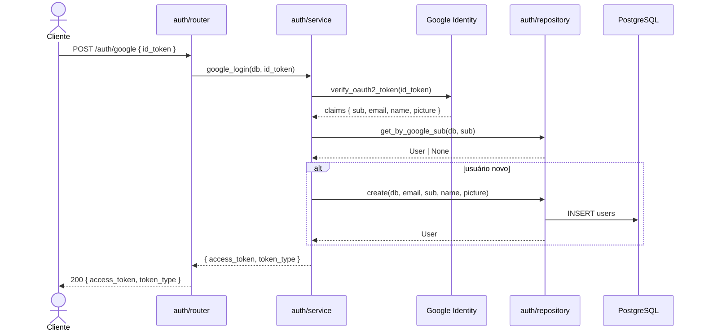
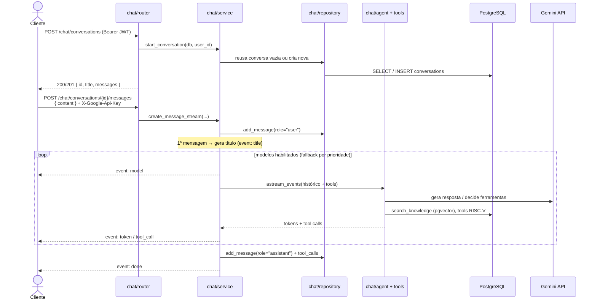
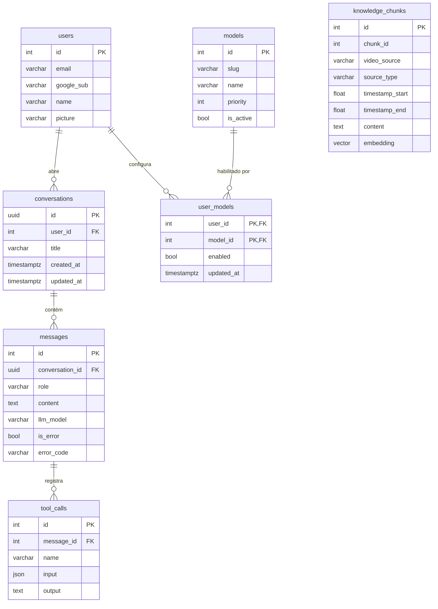

# ISCTools — Backend

API do **ISCTools**, uma plataforma de chatbot com IA que disponibiliza o **Lamarzito**, um tutor especializado em **Organização e Arquitetura de Computadores (OAC)** da Universidade de Brasília (UnB). O assistente combina um agente baseado em LLM (Gemini), ferramentas de cálculo de RISC-V e busca semântica (RAG) sobre os materiais da disciplina.

---

## Sumário

- [Objetivo](#objetivo)
- [Principais recursos](#principais-recursos)
- [Arquitetura](#arquitetura)
- [Fluxo de interação](#fluxo-de-interação)
- [Diagrama ER](#diagrama-er)
- [Estrutura do projeto](#estrutura-do-projeto)
- [Como rodar](#como-rodar)
- [Variáveis de ambiente](#variáveis-de-ambiente)

---

## Objetivo

Fornecer uma API REST que permite ao usuário autenticado (via login com Google) abrir conversas com o **Lamarzito** e trocar mensagens em linguagem natural sobre OAC. As respostas são geradas por um agente que:

- usa **ferramentas determinísticas** para montar/desmontar instruções RISC-V, converter bases, calcular IEEE 754 e codificar imediatos;
- faz **busca semântica (RAG)** nos materiais da disciplina (aulas OAC e vídeos ISC) para fundamentar respostas conceituais;
- transmite a resposta em **streaming (SSE)**, token a token.

O histórico de cada conversa — incluindo as chamadas de ferramentas e eventuais erros — é persistido no PostgreSQL para continuidade e análise pedagógica.

---

## Principais recursos

- **Autenticação Google OAuth + JWT** — o cliente envia um `id_token` do Google; o backend valida, cria/recupera o usuário e devolve um JWT próprio usado nas demais rotas.
- **BYOK (Bring Your Own Key)** — a chave da API do Gemini **não é armazenada**; é enviada a cada requisição de chat no header `X-Google-Api-Key`.
- **Agente com ferramentas** — construído com LangGraph (`create_react_agent`) sobre `ChatGoogleGenerativeAI`, com um conjunto de ferramentas RISC-V e a busca na base de conhecimento.
- **RAG com pgvector** — trechos de transcrições são embeddados e armazenados como vetores; a busca por similaridade alimenta o agente com contexto autoritativo do professor.
- **Catálogo de modelos com fallback** — o usuário habilita/desabilita modelos Gemini; em caso de cota excedida ou indisponibilidade, o agente tenta o próximo modelo habilitado por ordem de prioridade.
- **Streaming SSE** — eventos `title`, `model`, `token`, `tool_call`, `error` e `done`.
- **Observabilidade com LangSmith** — tracing opcional das execuções do agente.

---

## Arquitetura

O backend é organizado em **módulos por domínio** (feature-based). Cada módulo expõe uma camada bem definida de responsabilidades:

| Camada | Arquivo | Responsabilidade |
|---|---|---|
| HTTP | `router.py` | Recebe requests, valida entrada, injeta dependências e converte erros de domínio (`ValueError`) em `HTTPException` |
| Negócio | `service.py` | Aplica regras de negócio, orquestra repositório, agente e provedor de IA; não conhece HTTP |
| Dados | `repository.py` | Única camada com acesso direto ao banco via SQLAlchemy; retorna ORM ou `None` |
| Contrato | `schemas.py` | Schemas Pydantic para request/response |
| Entidades | `models.py` | Modelos ORM mapeados para tabelas do PostgreSQL |

**Módulos ativos:**

- **`auth`** — login com Google, emissão e validação de JWT
- **`chat`** — conversas, mensagens em streaming, catálogo de modelos, agente e ferramentas RISC-V
- **`knowledge`** — ingestão e busca semântica (RAG) dos materiais da disciplina (módulo interno, sem router próprio — é consumido pelo agente do `chat`)

**Infraestrutura compartilhada** em `core/`:

- `config/` — settings tipados por domínio (`DatabaseSettings`, `GoogleOAuthSettings`, `JWTSettings`, `AgentSettings`, `LangSmithSettings`, `CORSSettings`), lidos do `.env` via `pydantic-settings` e agregados em `Configs`/`settings`
- `database.py` — engine, `SessionLocal`, `Base` e a dependency `get_db`
- `dependencies.py` — dependency `get_current_user` (valida o JWT e carrega o `User`)

---

## Fluxo de interação

### Autenticação (Google OAuth → JWT)



As rotas seguintes exigem o header `Authorization: Bearer <access_token>`.

### Chat com IA (streaming SSE)



Eventos SSE emitidos pelo stream: `title`, `model`, `token`, `tool_call`, `error`, `done`.

---

## Diagrama ER



`knowledge_chunks` é independente das tabelas de usuário — é a base vetorial consultada pelo RAG.

---

## Estrutura do projeto

```
backend/
├── .agents/                         # regras de arquitetura para agentes de IA
├── .agentes/                        # regras de arquitetura para agentes de IA
├── app/
│   ├── src/
│   │   ├── main.py                  # FastAPI, CORS, lifespan, registro de routers, /health
│   │   ├── core/
│   │   │   ├── config/
│   │   │   │   ├── __init__.py      # Configs + instância `settings`
│   │   │   │   ├── database.py      # DatabaseSettings (DATABASE_URL)
│   │   │   │   ├── google_oauth.py  # GoogleOAuthSettings (GOOGLE_CLIENT_ID)
│   │   │   │   ├── jwt.py           # JWTSettings (SECRET_KEY, expiração)
│   │   │   │   ├── agent.py         # AgentSettings + catálogo DEFAULT_MODELS
│   │   │   │   ├── langsmith.py     # LangSmithSettings (tracing)
│   │   │   │   └── cors.py          # CORSSettings (origens permitidas)
│   │   │   ├── database.py          # engine, SessionLocal, Base, get_db
│   │   │   └── dependencies.py      # get_current_user (JWT → User)
│   │   ├── auth/
│   │   │   ├── models.py            # User (email, google_sub, name, picture)
│   │   │   ├── schemas.py           # GoogleLoginPayload, UserOut, Token
│   │   │   ├── repository.py        # get_by_google_sub, get_by_id, create
│   │   │   ├── service.py           # google_login, decode_access_token
│   │   │   └── router.py            # POST /auth/google
│   │   ├── chat/
│   │   │   ├── models.py            # Conversation, Message, ToolCall, AIModel, UserModel
│   │   │   ├── schemas.py           # ConversationOut, MessageOut, ToolCallOut, ModelOption...
│   │   │   ├── repository.py        # conversas, mensagens, tool_calls, modelos
│   │   │   ├── service.py           # streaming SSE, fallback de modelos, classificação de erros
│   │   │   ├── agent.py             # system prompt, create_agent (LangGraph), generate_title
│   │   │   ├── tools.py             # ferramentas RISC-V + search_knowledge
│   │   │   └── router.py            # /chat/models, /chat/conversations, .../messages, .../retry
│   │   └── knowledge/
│   │       ├── models.py            # KnowledgeChunk (embedding pgvector)
│   │       ├── repository.py        # search_similar (busca vetorial)
│   │       └── service.py           # search (embed + retrieve)
│   ├── alembic/                     # migrations (001..008)
│   ├── alembic.ini
│   ├── scripts/
│   │   ├── seed_models.py           # popula o catálogo de modelos (tabela `models`)
│   │   └── ingest.py                # ingere os materiais na base de conhecimento (RAG)
│   ├── datas/                       # transcrições enriquecidas (fonte do RAG)
│   ├── docker-compose.yml           # pgvector/pgvector:pg16 + migrate + api
│   ├── Dockerfile                   # imagem da API
│   ├── Dockerfile.migrate           # imagem one-shot que aplica as migrations
│   ├── Makefile
│   ├── requirements.txt
│   ├── .env.example
│   └── .env
├── CLAUDE.md
└── README.md
```

---

## Como rodar

**Pré-requisito:** Docker e Docker Compose instalados.

```bash
cd app
cp .env.example .env   # preencha GOOGLE_CLIENT_ID, SECRET_KEY etc. (ver seção abaixo)

make up                # build + sobe banco (pgvector), serviço de migrate e API
make migrate           # aplica as migrations (caso necessário fora do compose)
```

> O serviço `migrate` do compose já aplica `alembic upgrade head` ao subir, dependendo do banco estar saudável. `make migrate` permanece disponível para reaplicar manualmente.

A API escuta na porta **8001** (variável `PORT`). No `docker-compose.yml` ela é apenas **exposta** à rede `coolify` (proxy reverso em deploy) — não há publicação de porta no host. Para acessar localmente, publique a porta (adicionando um mapeamento `ports: ["8001:8001"]`) ou rode a API direto com uvicorn.

Health check em `/health`. Documentação interativa (Swagger) em `/docs`.

### Popular o catálogo de modelos e a base de conhecimento

Esses scripts rodam localmente (precisam de `DATABASE_URL` acessível e, no caso da ingestão, de uma chave de embeddings do Gemini):

```bash
python scripts/seed_models.py      # upsert do catálogo `models` a partir de DEFAULT_MODELS
python scripts/ingest.py           # embeda e insere os trechos de datas/ em knowledge_chunks
```

`scripts/ingest.py` aceita flags como `--data-dir`, `--skip-existing`, `--force`, `--batch-size`, `--max-chars` e `--sleep` para controlar o ritmo das chamadas de embedding.

### Comandos úteis (Makefile)

```bash
make up                          # build das imagens e sobe os containers
make down                        # encerra os containers
make logs                        # acompanha logs da API em tempo real
make migration name="<descricao>" # gera nova migration via autogenerate (containers de pé)
make migrate                     # aplica as migrations pendentes
make rollback                    # desfaz a última migration
```

---

## Variáveis de ambiente

Lidas do `.env` via `pydantic-settings`. Veja `.env.example` para os valores de exemplo.

| Variável | Obrigatória | Descrição |
|---|---|---|
| `DATABASE_URL` | sim | URL de conexão do PostgreSQL (ex.: `postgresql://isctools:isctools@db:5432/isctools`) |
| `POSTGRES_USER` / `POSTGRES_PASSWORD` / `POSTGRES_DB` | sim (compose) | credenciais usadas pelo container Postgres |
| `GOOGLE_CLIENT_ID` | sim | client ID do Google usado para validar o `id_token` no login |
| `SECRET_KEY` | sim | segredo para assinar os JWTs (HS256) |
| `JWT_EXPIRE_MINUTES` | não | expiração do JWT em minutos (padrão `30`) |
| `AGENT_WINDOW_SIZE` | não | nº de mensagens recentes enviadas ao agente como contexto (padrão `10`) |
| `CORS_ALLOWED_ORIGINS` | não | origens permitidas, separadas por vírgula, sem barra final |
| `LANGSMITH_TRACING` | não | habilita tracing no LangSmith (`true`/`false`, padrão `false`) |
| `LANGSMITH_API_KEY` | condicional | obrigatória quando `LANGSMITH_TRACING=true` |
| `LANGSMITH_PROJECT` | não | nome do projeto no LangSmith (padrão `isctools`) |
| `LANGSMITH_ENDPOINT` | não | endpoint do LangSmith |

> A chave da API do Gemini **não** é uma variável de ambiente do servidor: cada cliente envia a sua no header `X-Google-Api-Key` ao chamar as rotas de mensagem.
