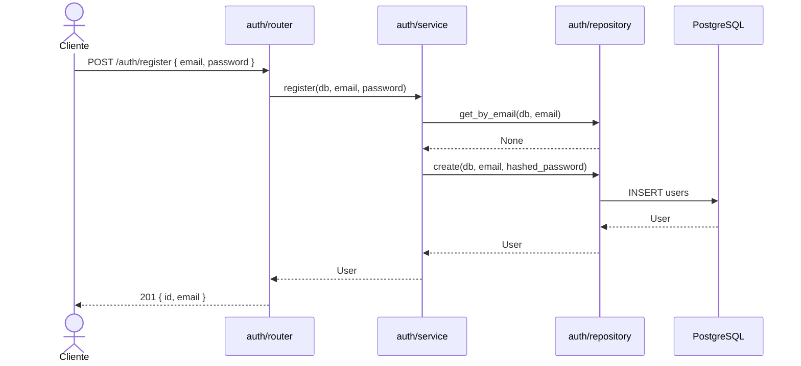
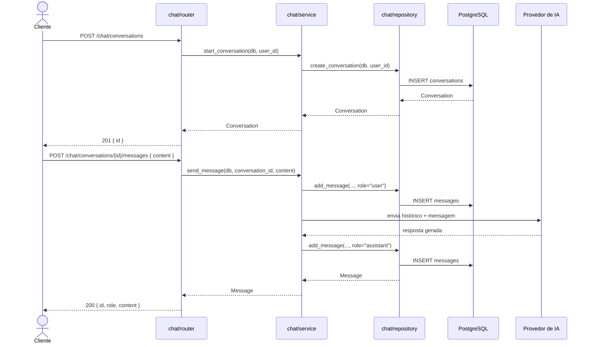
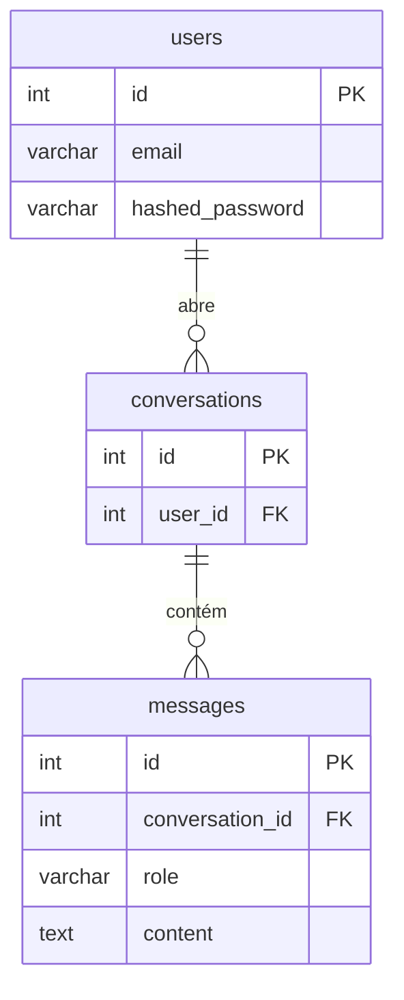

# ISCTools — Backend

API do sistema ISCTools, uma plataforma de chatbot com IA para auxiliar estudantes a discutir e explorar o conteúdo de uma disciplina.

---

## Sumário

- [Objetivo](#objetivo)
- [Arquitetura](#arquitetura)
- [Fluxo de interação](#fluxo-de-interação)
- [Diagrama ER](#diagrama-er)
- [Estrutura do projeto](#estrutura-do-projeto)
- [Como rodar](#como-rodar)

---

## Objetivo

Fornecer uma API REST que permite ao usuário autenticado abrir conversas com um assistente de IA especializado em uma disciplina e trocar mensagens em linguagem natural. O histórico de cada conversa é persistido no banco de dados para permitir continuidade e futura análise pedagógica.

---

## Arquitetura

O backend é organizado em **módulos por domínio** (feature-based). Cada módulo é autossuficiente e expõe uma camada bem definida de responsabilidades:

| Camada | Arquivo | Responsabilidade |
|---|---|---|
| HTTP | `router.py` | Recebe requests, valida entrada, retorna responses e converte erros de domínio em HTTP |
| Negócio | `service.py` | Aplica regras de negócio, orquestra chamadas ao repositório e ao provedor de IA |
| Dados | `repository.py` | Única camada com acesso direto ao banco via SQLAlchemy |
| Contrato | `schemas.py` | Schemas Pydantic para request/response |
| Entidades | `models.py` | Modelos ORM mapeados para tabelas do PostgreSQL |

**Módulos ativos:**

- **`auth`** — cadastro e autenticação de usuários
- **`chat`** — gerenciamento de conversas e troca de mensagens com a IA

**Infraestrutura compartilhada** em `core/`:

- `config.py` — leitura de variáveis de ambiente via `pydantic-settings`
- `database.py` — engine, sessão e dependency `get_db`

---

## Fluxo de interação

### Autenticação



### Chat com IA



---

## Diagrama ER



---

## Estrutura do projeto

```
backend/
├── .agentes/                        # regras de arquitetura para agentes de IA
├── .agents/                         # regras de arquitetura para agentes de IA
├── app/
│   ├── src/
│   │   ├── main.py                  # instância FastAPI e registro de routers
│   │   ├── core/
│   │   │   ├── config.py            # variáveis de ambiente (pydantic-settings)
│   │   │   └── database.py          # engine, SessionLocal, Base, get_db
│   │   ├── auth/
│   │   │   ├── models.py            # User
│   │   │   ├── schemas.py           # UserCreate, UserOut, Token
│   │   │   ├── repository.py        # get_by_email, create
│   │   │   ├── service.py           # register, get_or_raise
│   │   │   └── router.py            # POST /auth/register
│   │   └── chat/
│   │       ├── models.py            # Conversation, Message
│   │       ├── schemas.py           # ConversationOut, MessageOut, SendMessage
│   │       ├── repository.py        # create_conversation, get_conversation, add_message
│   │       ├── service.py           # start_conversation, send_message
│   │       └── router.py            # POST /chat/conversations, POST /chat/conversations/{id}/messages
│   ├── alembic/                     # migrations geradas pelo Alembic
│   ├── alembic.ini
│   ├── docker-compose.yml           # postgres:16 + api
│   ├── Dockerfile
│   ├── Makefile
│   ├── requirements.txt
│   └── .env
├── CLAUDE.md
└── README.md
```

---

## Como rodar

**Pré-requisito:** Docker e Docker Compose instalados.

```bash
cd app
cp .env.example .env   # ajuste as variáveis se necessário

make up                # sobe API + banco
make migrate           # aplica as migrations
```

A API estará disponível em `http://localhost:8000`.
Documentação interativa (Swagger) em `http://localhost:8000/docs`.

### Outros comandos úteis

```bash
make logs                        # acompanha logs da API em tempo real
make migration name="<descricao>" # gera nova migration via autogenerate
make rollback                    # desfaz a última migration
make down                        # encerra os containers
```
