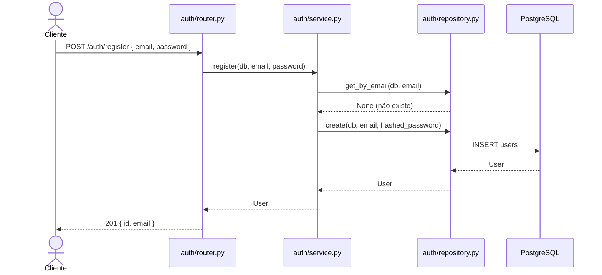
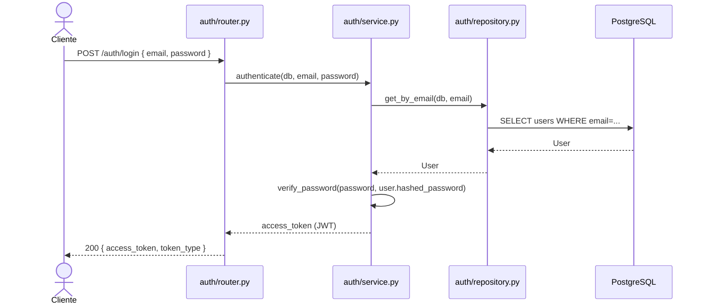
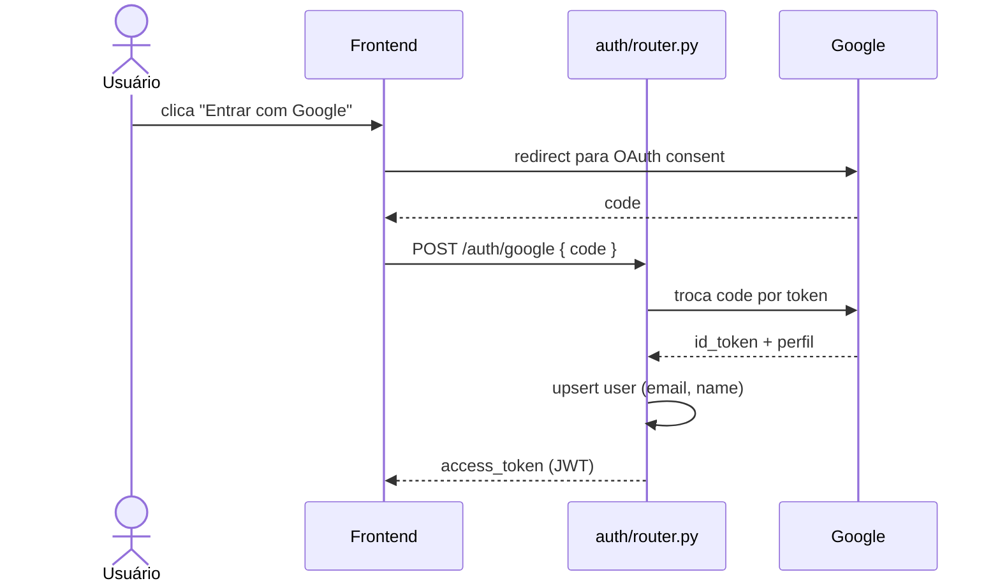

# Fluxo de Dados — Autenticação

## Registro de usuário

```
POST /auth/register { email, password }
```



## Login (JWT)

```
POST /auth/login { email, password }
```



## Login via Google OAuth

O fluxo OAuth é gerenciado por `core/config/google_oauth.py`. O frontend redireciona o usuário para o endpoint do Google, que devolve um `code`. O backend troca o código pelo token e upserta o usuário.



## Proteção de rotas

Rotas protegidas injetam `current_user` via `Depends(get_current_user)` definido em `core/dependencies.py`. O middleware valida o JWT e lança `401` se inválido ou expirado.
