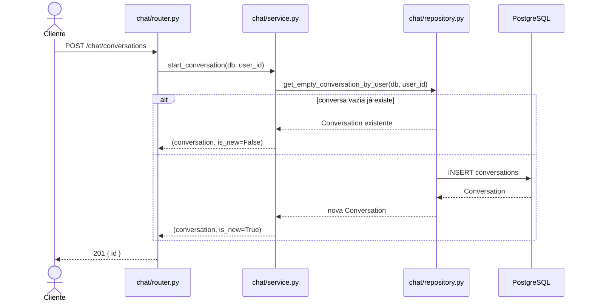
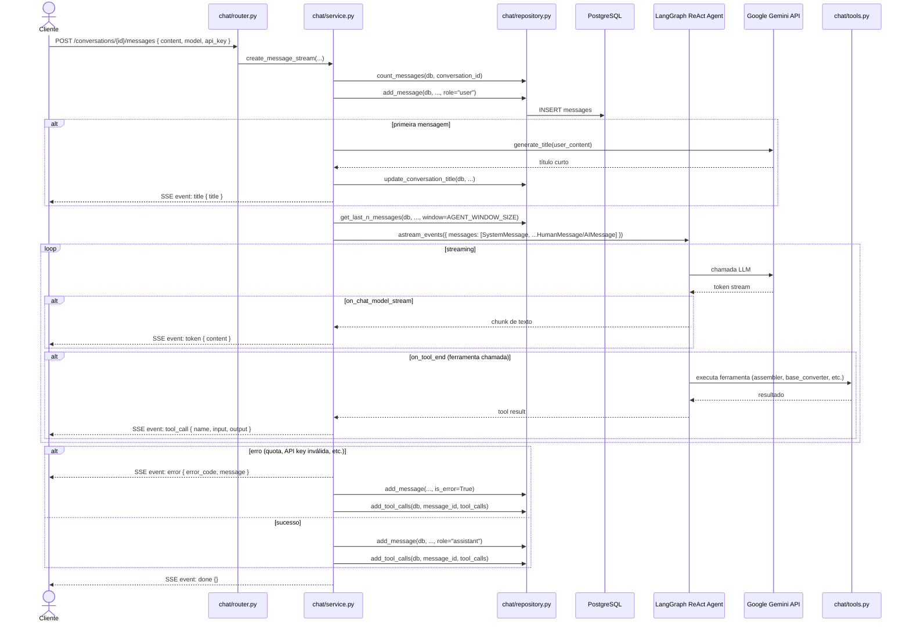

# Fluxo de Dados — Chat e Streaming SSE

## Criar conversa

```
POST /chat/conversations
```

O serviço reutiliza a última conversa vazia do usuário, se existir, em vez de criar uma nova (`start_conversation` em `chat/service.py:36`).



## Enviar mensagem (streaming SSE)

```
POST /chat/conversations/{id}/messages  { content, model, api_key }
```

A resposta é um stream Server-Sent Events. O cliente lê eventos em tempo real enquanto o agente processa.



## Eventos SSE emitidos

| Evento | Payload | Quando |
|---|---|---|
| `title` | `{ title: string }` | Só na primeira mensagem da conversa |
| `token` | `{ content: string }` | A cada fragmento de texto gerado |
| `tool_call` | `{ name, input, output }` | Após cada ferramenta executada |
| `error` | `{ error_code?, message }` | Em exceções do LLM ou rede |
| `done` | `{}` | Sempre ao final, com ou sem erro |

## Retry de mensagem

```
POST /chat/conversations/{id}/messages/retry
```

Busca a última mensagem do usuário e re-executa o stream. Se a mensagem anterior falhou com tool calls registrados, eles são reinjetados no histórico para evitar reprocessamento.

## Janela de contexto

Controlada por `AGENT_WINDOW_SIZE` (padrão: 10). O serviço busca as últimas N mensagens via `repository.get_last_n_messages` antes de montar o histórico do LangGraph. Mensagens com `is_error=True` são ignoradas na construção do contexto.
