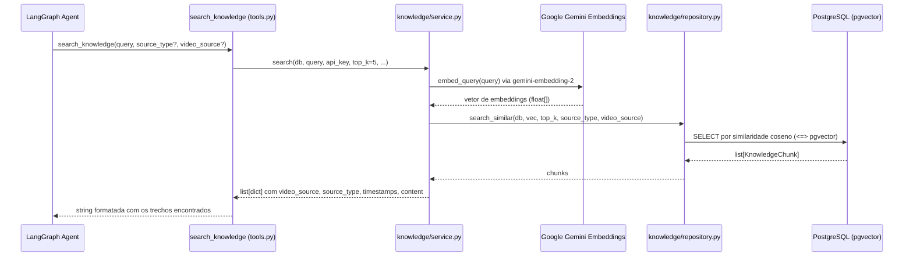

# Fluxo de Dados — Knowledge Retrieval (RAG)

## Visão geral

A ferramenta `search_knowledge` implementa um pipeline RAG (Retrieval-Augmented Generation) para buscar trechos dos materiais da disciplina armazenados com embeddings vetoriais no PostgreSQL via `pgvector`.

## Fluxo completo



## Fontes de dados disponíveis

| `source_type` | Descrição |
|---|---|
| `aulas_oac` | Transcrições das aulas de Organização e Arquitetura de Computadores |
| `youtube_isc` | Transcrições de vídeos do canal ISC no YouTube |

## Filtros suportados pela ferramenta

```python
search_knowledge(
    query="como funciona forwarding no pipeline",
    source_type="aulas_oac",        # opcional — filtra por tipo de fonte
    video_source="OAC_2022-01-17.mp4"  # opcional — filtra por arquivo específico
)
```

## Retorno para o agente

Cada trecho retornado inclui:
- Nome do arquivo de vídeo (`video_source`)
- Tipo da fonte (`source_type`)
- Intervalo de tempo no vídeo (`timestamp_start` / `timestamp_end` em segundos)
- Texto transcrito (`content`)

O agente usa essas informações para contextualizar a resposta e citar a aula de origem.

## Onde os dados ficam

Os chunks são carregados na tabela `knowledge_chunks` via scripts em `app/scripts/`. Os arquivos brutos de transcrição ficam em `app/datas/`.
