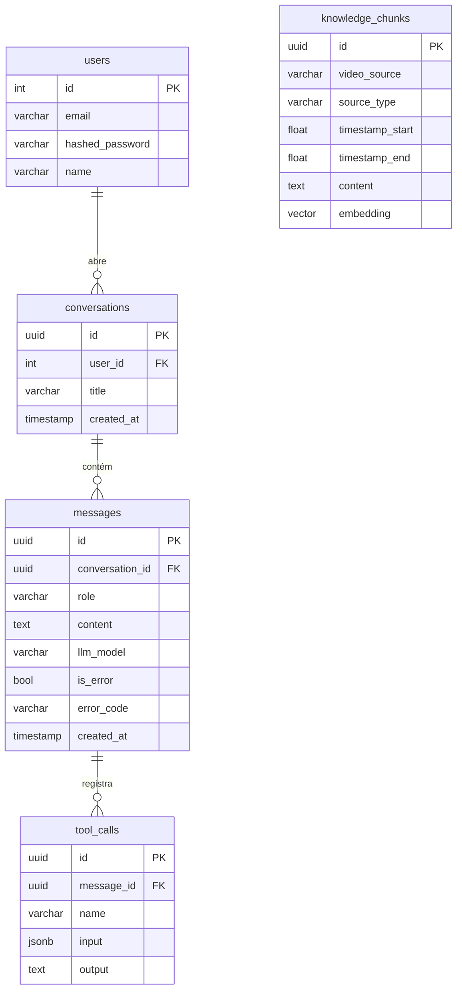

# Infra — Banco de Dados

## PostgreSQL + pgvector

O projeto usa PostgreSQL 16 com a extensão `pgvector` para armazenar embeddings vetoriais da base de conhecimento.

## Diagrama ER



## Migrations

Gerenciadas pelo Alembic em `app/alembic/`. Cada migration fica em `alembic/versions/`.

Para adicionar uma nova migration:
```bash
cd app
make migration name="descricao_da_mudanca"
```

A migration é gerada com `--autogenerate` a partir dos modelos SQLAlchemy. **Requisito**: o container da API precisa estar rodando.

## Sessão de banco

`core/database.py` expõe:
- `engine` — engine SQLAlchemy
- `SessionLocal` — factory de sessões
- `get_db` — dependency FastAPI que abre e fecha sessão por request

Cada request recebe uma sessão isolada via `Depends(get_db)`. A sessão é fechada no finally do dependency.
